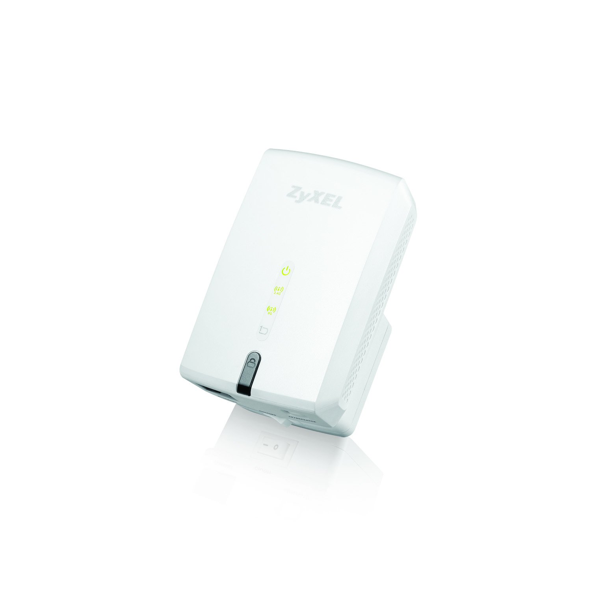

# ZyXEL WRE6505 (Wireless range extender, 2.4GHz+5GHz)

https://fccid.io/I88WRE6505/Internal-Photos/internal-photos-2328908.html

======

## Structure

	openwrt/

contains essentials to add to a checkout of the openwrt git tree, to be able to compile an identical initramfs-kernel.bin

	data-sheets/

misc chip-set datasheets, and product manual

	mtd_firmwares/

raw dump of factory mtd flash

	oem_source/

copy of the OEM source-code requested from ZyXEL. 

	terminal-output/

output from various commands run on the OEM firmware captured to text. 

======

## Hardware manifest

The front/external of the device has 

5x multi-coloured LEDs, indicating
-power (green)
-2.4g status (red/orange/green)
-5g status (red/orange/green)
-LAN status (green)
-WPS status (blue)

1x WPS pushbutton (see LED above)

1x AP/Repeater Physical mode switch (for toggling between AP/repeater modes in ZyXEL firmware)
-toggling this switch triggers a restart of the device on the OEM firmware

1x Ethernet port

1x Power Switch

======

## Components

Included parts in this device

### Memory
32M x 16bit (512Mbit) DDR2-800 SDRAM

64MB

Winbond 
W9751G6KB-25I
65349B000022
550PUA TWN

https://www.winbond.com/hq/product/specialty-dram/ddr2-sdram/?__locale=en&partNo=W9751G6KB
https://www.winbond.com/resource-files/w9751g6kb_a09_20170123.pdf

https://elcodis.com/parts/6244317/W9751G6KB.html

### 5G

WLAN (5G - front end module)
SKY11
85703

http://www.skyworksinc.com/Product/1706/SKY85703-11

### 5G

WLAN (5G - 433MHz PHY 802.11ac 1T1R)
MediaTek
MT7610EN
1601-AMAL

https://www.mediatek.com/products/broadbandWifi/mt7610e

### 2.4G

WLAN (2.4G 802.11N 2T2R)
MediaTek
MT7620A
1549-BMTH
FTP48C70H

MIPS24KEc

https://www.mediatek.com/products/homeNetworking/mt7620n-a

### Serial

Serial
TX|GND|RX|3.3V (square copper hole)

### USB

USB1
G|D-|D+|DC (square copper hole)

### Ethernet driver

(on the reverse side)
Ethernet (100Mbit)
FunJin
PC161S 1546

### Flash

Macronix Serial Flash (64MBit)
MXIC MX
25L6406E
M2I-12G
3T628700
 L154083

https://www.macronix.com/Lists/Datasheet/Attachments/7370/MX25L6406E,%203V,%2064Mb,%20v1.9.pdf
https://www.macronix.com/en-us/products/NOR-Flash/Serial-NOR-Flash/Pages/spec.aspx?p=MX25L6406E

